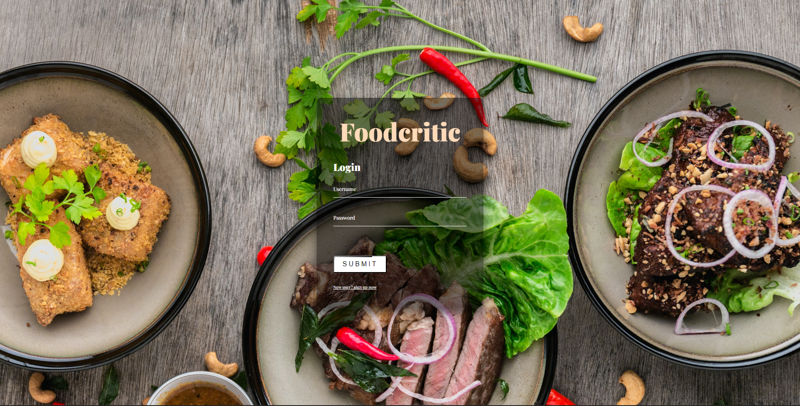
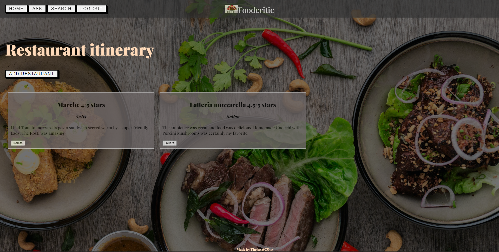
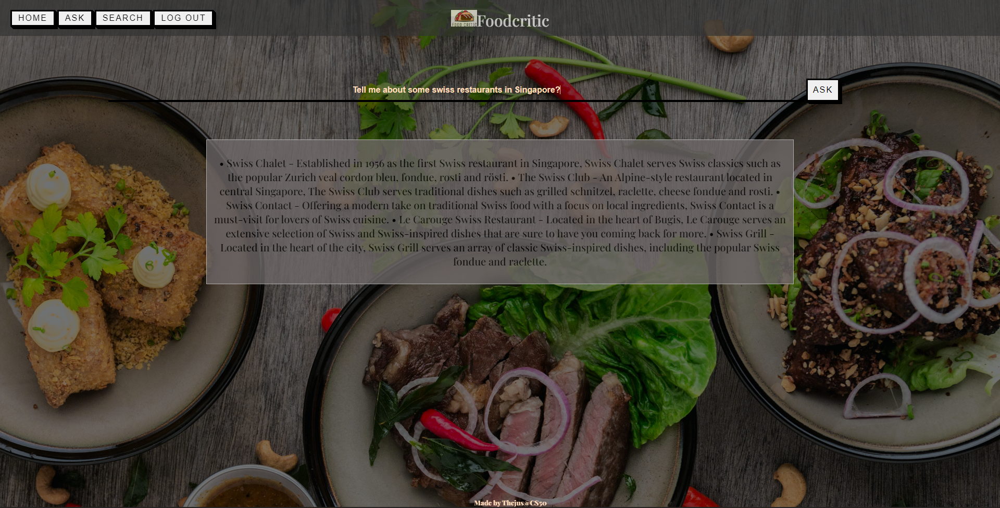
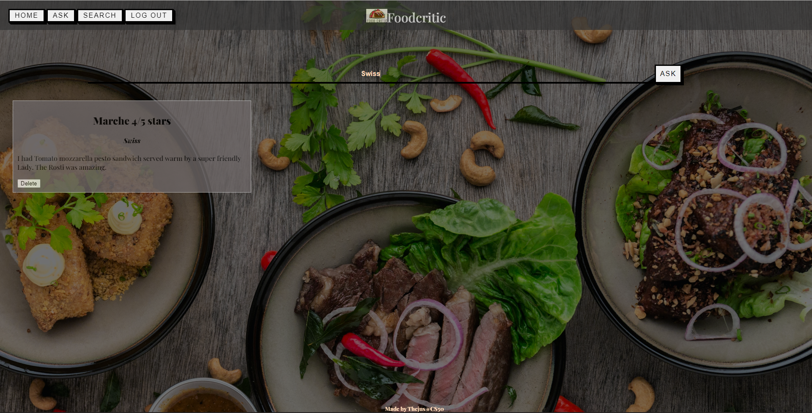

# Foodcritic

Foodcritic is a simplistic web application designed to assist users in tracking and reviewing the restaurants they have visited. Built with Flask, this application provides an intuitive interface for logging in, adding restaurant reviews, and seeking or searching for restaurant information.

## Navigation Flow

1. **Login Page**:
   
    - On initiating the Flask application, users are redirected to the `/login` route showcasing a login page sourced from `login.html`.
    - The login form mandates both username and password fields.
    - Upon submission, a backend verification against the `users` table in `uniplanner.db` is performed to authenticate credentials.
    - Successful authentication redirects users to the home page (`/` route).

3. **Home Page**:
   
    - The home page furnishes several navigation buttons including "Home", "Ask", "Search", and "Log Off" which route to `/`, `/ask`, `/search`, and `/logoff` respectively via GET method.
    - An "ADD RESTAURANT" button, routing to `/add` via GET, enables users to review a restaurant through a form presented in `add.html`.
    - The form captures various restaurant details with an optional description field, and on submission, routes to `/add` via POST, saving the information to the `restaurants` table in `uniplanner.db`.

5. **Ask Page using OpenAI API**:
   
    - Accessible via the "Ask" button, this page routes to `/ask` via GET and displays a form from `ask.html`.
    - Utilizing an OpenAI API (with a generated free API key) a `gpt_ask(question)` function in `helpers.py` processes user queries.
    - The function’s output is iteratively displayed on `ask.html`.

7. **Search Page**:
   
    - Triggered by the "Search" button, this page routes to `/search` via GET, presenting a form on `search.html` for users to input restaurant name or cuisine.
    - The input is sent back to `/search` via POST, and an SQL query filters restaurants based on the given criteria, returning the results to `search.html`.

## Technical Specifications

- **Framework**: Flask
- **Database**: SQLite (`uniplanner.db`)
- **Template Files**: `login.html`, `add.html`, `ask.html`, `search.html`
- **Additional Libraries**: OpenAI

## Installation and Running Webapp locally

#### Prerequisites

Ensure you have the following installed on your machine:
- Python 3
- pip (Python's package installer)

#### Installation

1. **Clone the repository**:
   ```bash
   git clone https://github.com/thejus03/foodcritic.git
   cd foodcritic
   
2. **Install required packages**
   ```bash
   pip install -r requirements.txt

4. **Run app**:
   ```bash
   flask run

#### Stopping application
To stop webapp press `CTRL` + `C` in the terminal.


